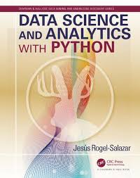

# Data Science and Analytics with Python
Data Science and Analytics with Python: All examples in Jupyter Notebooks

This repository contains all the examples from [Data Science and Analytics with Python](https://www.crcpress.com/Data-Science-and-Analytics-with-Python/Rogel-Salazar/p/book/9781498742092), in the form of (free!) Jupyter notebooks.



## How to Use this Book

- Run the code using the Jupyter notebooks available in this repository's [notebooks](notebooks) directory.

- Buy the printed book through [CRC Press](https://www.crcpress.com/Data-Science-and-Analytics-with-Python/Rogel-Salazar/p/book/9781498742092)
or [Amazon](https://www.amazon.co.uk/Science-Analytics-Chapman-Knowledge-Discovery/dp/1498742092)

## About

This book was written by [Jesus Rogel-Salazar](https://uk.linkedin.com/in/jesusrogel) which I have the pleasure to work with at AKQA London. I have decided to 
rewrite all the notebooks examples to both refresh my Data Science and Machine Learning skills and in order to make this 
material available and easily accessible to more colleagues and anyone interested in the field.

For the structure of this repository I have taken inspiration and most of the times copied shamelessly  [Python Data Science Handbook](https://github.com/jakevdp/PythonDataScienceHandbook)


## Software

The code in the book was tested with Python 3.5.

To create a stand-alone environment named ``DSAP`` with Python 3.5 and all the required package versions, run the following:

```
$ conda env create -f environment.yml
$ source activate DSAP
```


## License
[UPDATE]

